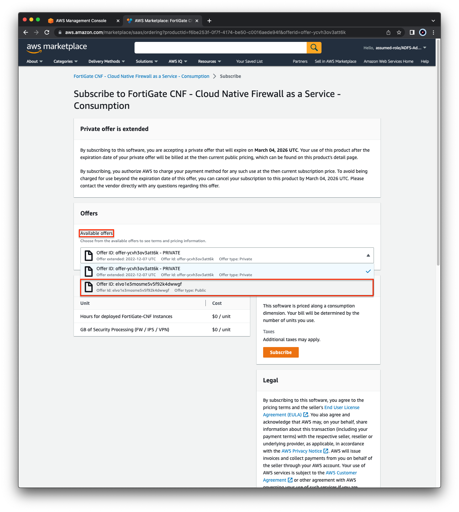
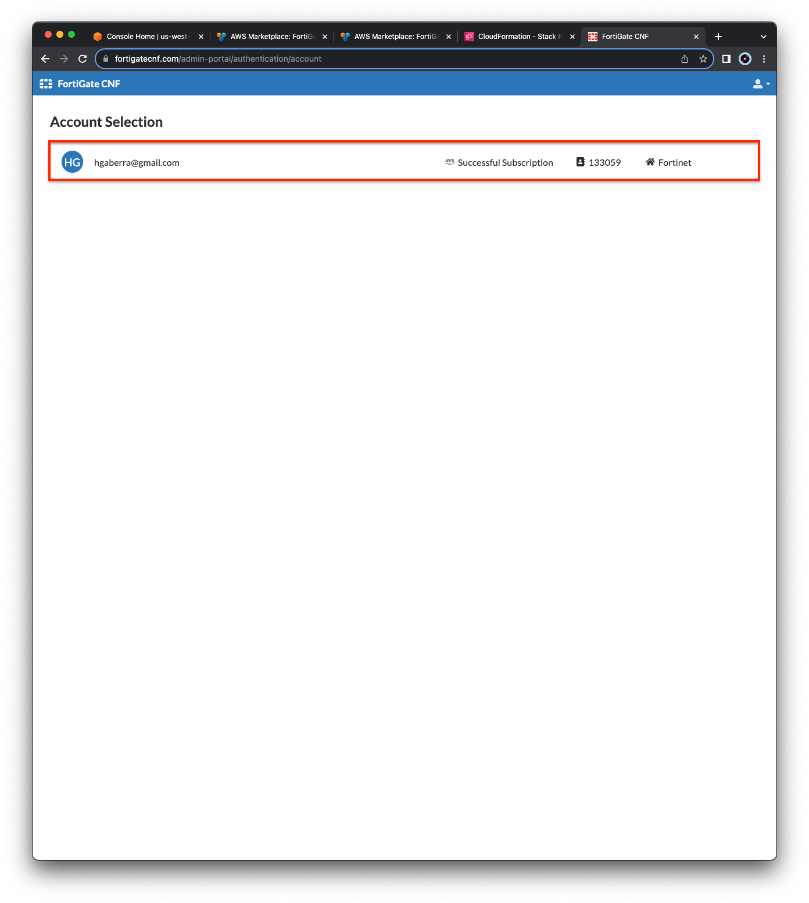

## Task 1: Subscribe to FortiGate CNF in AWS Marketplace & Onboard an AWS account

- 1.  Log into your AWS account and navigate to the AWS Marketplace listing for [**FortiGate CNF (click for MP listing)**](https://aws.amazon.com/marketplace/pp/prodview-vtjjha5neo52i). In the upper right corner, click **View purchase options**. On the next page, click **Subscribe**.

- 2.  In the available offers list, **select the Public offer**.

- 3.  The page should update and show the GA pricing. Click **Subscribe**.

- 4. A green banner will be at the top of the screen. Click **Set up your account** and this will open a new tab in the AWS Marketplace console.

- 5.  Select **Login or create vendor account** and this will open a pop up window to login to FortiCloud.  

{}
**If you have an existing FortiCloud Account**, click **Login**. Otherwise, the register button will walk you through creating your own account quickly.
{}

- 6.  Once completed, you will see that the FortiCloud account is now linked with the AWS account.  Click **Launch template** to open a new tab in the CloudFormation console.  On the CloudFormation console, **tick the Capabilities box** and then click **Create stack**. Once the template has been successfully created, move on to the next step.

{}
**Please use the us-west-2 (Oregon) region for this template**.  If you are in a different region, simply click on the region in the upper right hand corner and select Oregon.
{}

- 7.  **Login to [FortiGate CNF Console](https://fortigatecnf.com/admin-portal/authentication/login)**. Once logged in, **click on your account tile** and you will see the CNF dashboard.

{}
If you see **No Subscription Found**, please logout, wait 10-15 minutes, and try again.  You should see **Successful Subscription** once the backend registration is completed.
{}

- 8.  This concludes this section.
