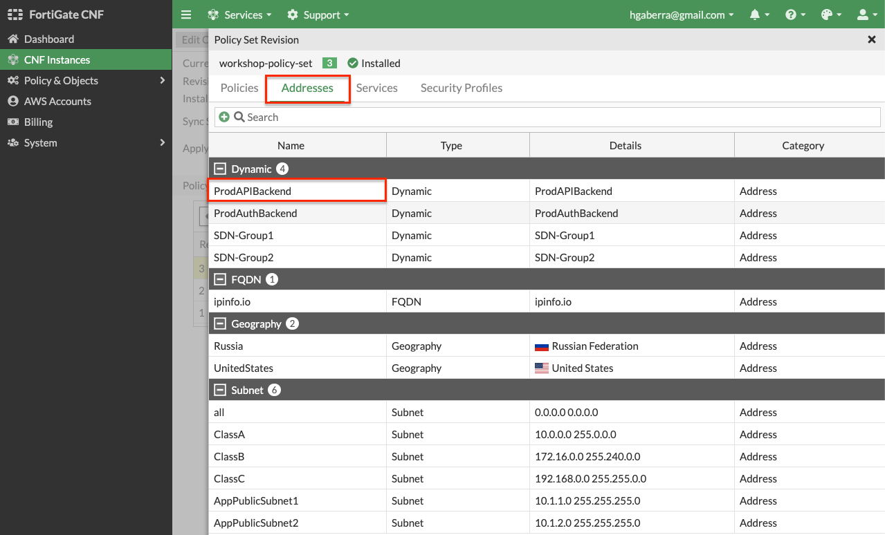
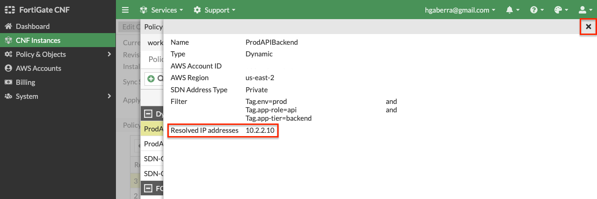
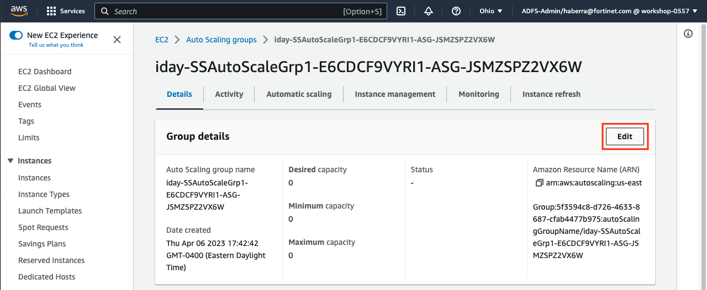
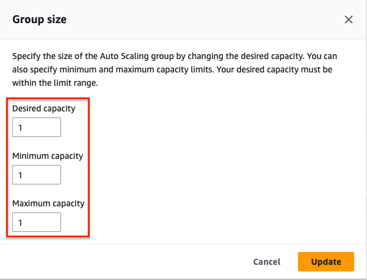
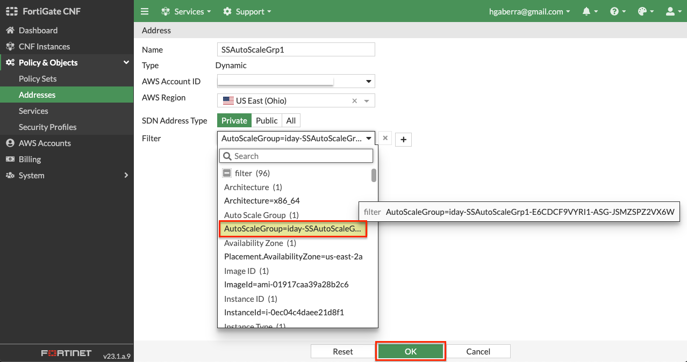

## Task 4: Validate Resolution of Dynamic Address Objects

- 1.  At this point, we are using a few dynamic address objects in our policy set. To confirm what they have resolved to, **navigate to CNF Instances** page and **right click the instance** and **select View Policy Set Revision.**

- 2.  On the pop up window, **select the Addresses tab** and **double click each of the dynamic address objects** to confirm they resolve the IP addresses listed below.

Name | IP Address | Instance
---|---|---
ProdAPIBackend | 10.2.2.10 | WrkInstance2
ProdAuthBackend | 10.1.2.10 | SSInstance1
SDNGroup1 | 10.1.3.10 & 10.1.4.10 | AppInstance1 & AppInstance2
SDNGroup2 | 10.2.1.10 & 10.2.2.10 | WrkInstance1 & WrkInstance2

{}
**Note:** The Dynamic Address Objects are resolved again every 60 seconds to maintain an up to date list of addresses.
{}

- 3.  In the EC2 Console, **Navigate to Auto Scaling > Auto Scale Groups** then **select and edit the existing group.**

- 4.  Next, edit the group details and **set the Desired, Minimum, and Maximum capacity to 1**. A new EC2 instance will be launched within a minute or two.

- 5.  In the **CNF console navigate to Policy & Objects > Addresses** and **create a new dynamic address object** based on the Auto Scale Group name, reference the values below:

Type | AWS Account ID | AWS Region
---|---|---
Dynamic | Workshop-AWS-Account-ID | us-east-2

Name | SDN Address Type | Filter Value
---|---|---
SSAutoScaleGrp1 | Private | AutoScaleGroup-iday-SSAutoScaleGroup1-...

{}
**Note:** The unique identifier at the end of the Auto Scale Group will be different in your environment.
{}

- 6.  For the address object to be resolved, it must be used in a policy set that is applied to a deployed CNF Instance. In the **CNF console navigate to Policy & Objects > Policy Sets**, then **edit** the existing policy set, and **add** the new address object to the **IPinfo-Egress** rule as an additional source.

- 7.  **Navigate to CNF Instances** page and **right click** the entry and **select Sync Policy Set**, then within a **few seconds click Refresh.**

- 8.  On the CNF Instances page and **right click** the instance and **select View Policy Set Revision** again, then **select the Addresses tab** and **double click the new dynamic address object** to see the resolved private IP.

{}
**Note:** The resolved IP address value will be different in your environment.
{}

- 9.  The CNF Instance will continue to check what running resources match the configured filter in the dynamic address objects and update the list of resolved IP(s). To see this in action, in the **EC2 Console, Navigate to Auto Scaling > Auto Scale Groups** then **select and edit the existing group** and set the **Desired, Minimum, and Maximum capacity to 3**.

- 10.  Within 60 seconds the existing address object will be updated. **Navigate to CNF Instances** page and **right click** the instance and **select View Policy Set Revision** again, then **select the Addresses tab** and **double click the new dynamic address object** to see the latest resolved private IPs.

- 11. This concludes this section.
