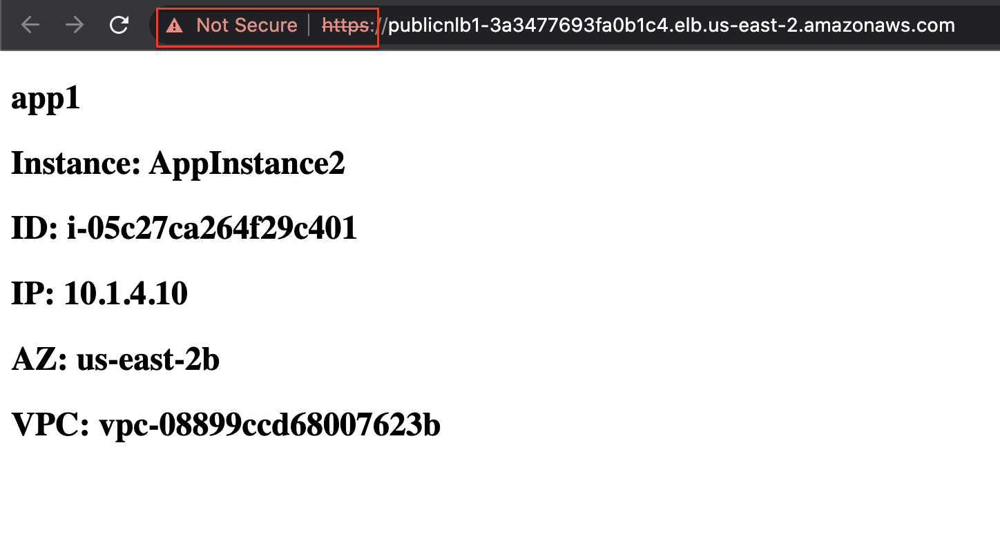

For this traffic flow we will focus on the Application VPC. Distributed ingress is commonly used when there is a need to inspect traffic for a VPC that is directly accessible with an attached IGW and resources with a public Elastic IP (EIP) or behind a public load balancer (ie ALB, NLB, etc). The benefit of this design is that traffic does not need to traverse additional AWS networking components for inspection so each VPC is isolated from others. The caveat to consider is that each VPC would need a directly attached IGW and resources such as load balancers, NAT GWs, etc that have additional cost.

**Step 1:** An inbound connection starts with an external user initiating a connection to a public resource such as a public NLB. The public NLB has a DNS record that resolves to a public IP for one of the NLB's Elastic Network Interface (ENI) in either public subnet. The first packet (ie TCP SYN) will then be seen at the IGW attached to the VPC where the public NLB is deployed. Since there is a Ingress route table assigned to the IGW, traffic destined to either public subnet will be sent to the GWLBe endpoint in the same AZ.

{}
The IGW will perform destination NAT to change the public IP of the NLB to the private IP of the NLB ENI.
{}

**Step 2:** The traffic is received at the GWLBe endpoint which then routes the traffic to the associated GWLB ENI in the same AZ in the managed Fortinet AWS account/VPC. This is done behind the scene using AWS Private Link.

**Step 3:** The traffic is received at the GWLB ENI and is then encapsulated in a GENEVE tunnel and routed to one of the instances in the FortiGate CNF auto scale group for traffic inspection. Post inspection, if the traffic is allowed, the instance will hairpin the traffic back to the same GWLB ENI over GENEVE. Then the GWLB ENI will hairpin the traffic back to the same GWLBe endpoint.

**Step 4:** The GWLBe endpoint will then route the inspected traffic to the intrinsic router. The intrinsic router will route traffic directly to the NLB's ENI as specified in the VPC route table assigned to the subnet.

**Step 5:** The NLB will send traffic to a healthy target, in either AZ since cross zone load balancing is enabled.

{}
The NLB will perform destination NAT to change the private IP to that of the healthy target.
{}

**Step 6:** The web server will receive the traffic and respond. The return traffic will flow these steps in reverse.

- 1.  To test out this flow navigate to the AWS CloudFormation console and **toggle the view nested button to off** > then select the stack name > and on the details pane select the outputs tab. You should see the output for **URLforApp1**. Click on the value for that output to check that App1 is no longer reachable now. Click on the value for the output **EncryptedURLforApp1** and you will see the self-signed certificate warning. Once you accept the warning, you will see the test web page.

{}
You are now only allowing HTTPS inbound to your environment that is sourced from a public IP within the United States!
{}

