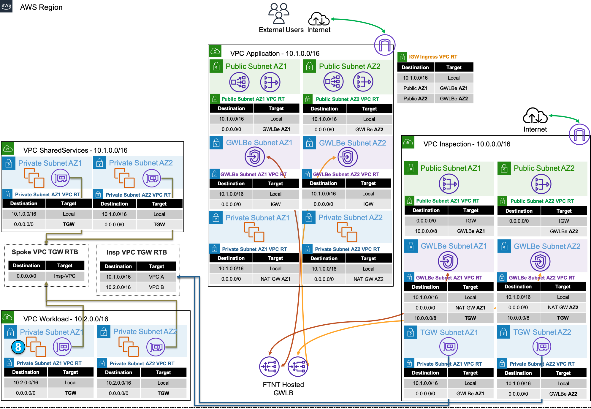

In this section you will validate that the policy set is controlling traffic as intended. Below is the overall architecture of the environment.

We will look into these specific traffic flows:

  * **Distributed Ingress**
  * **Distributed Egress**
  * **Centralized Egress**
  * **Centralized East West**

