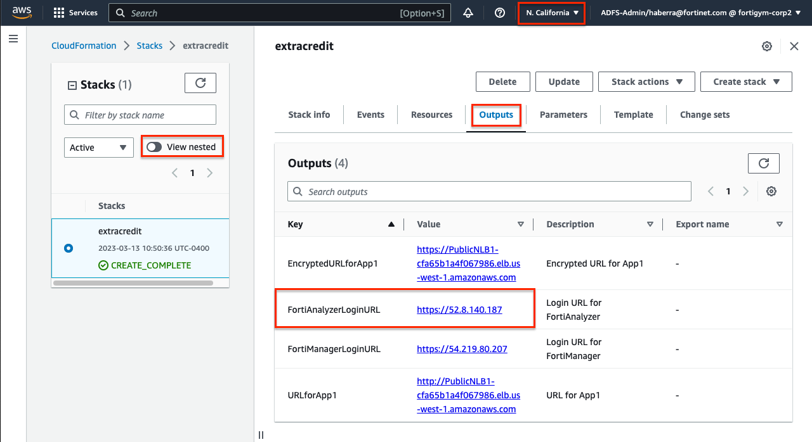
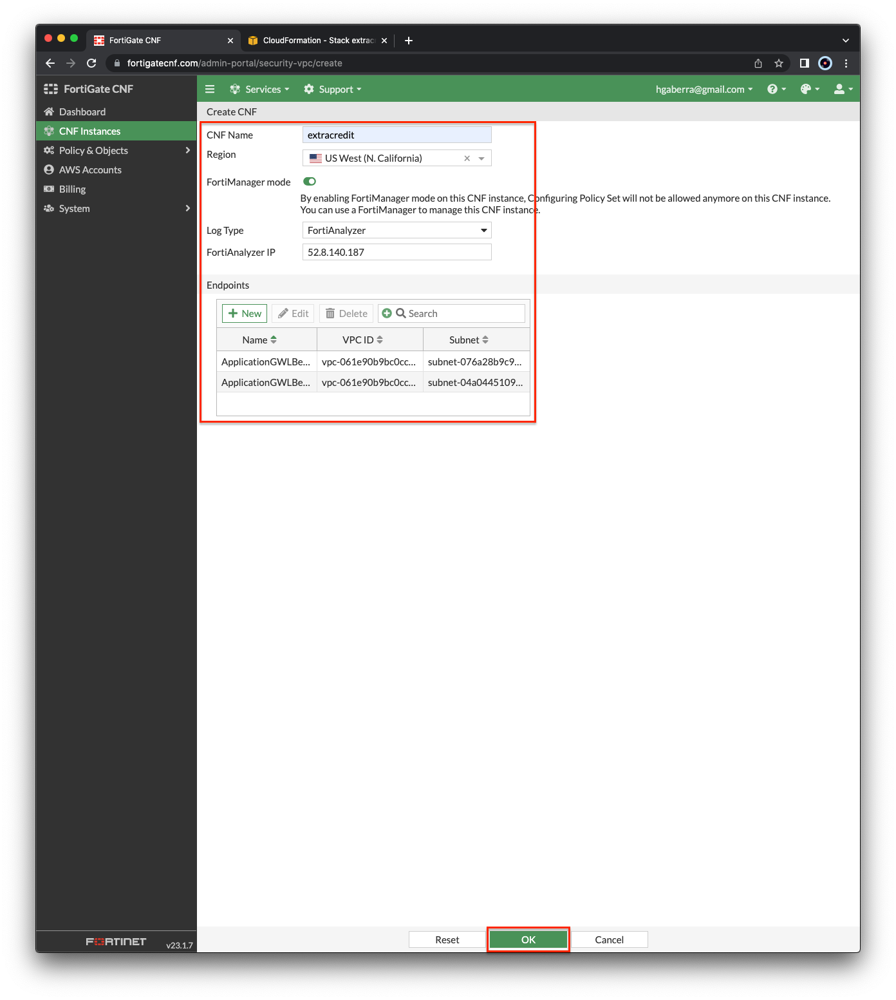
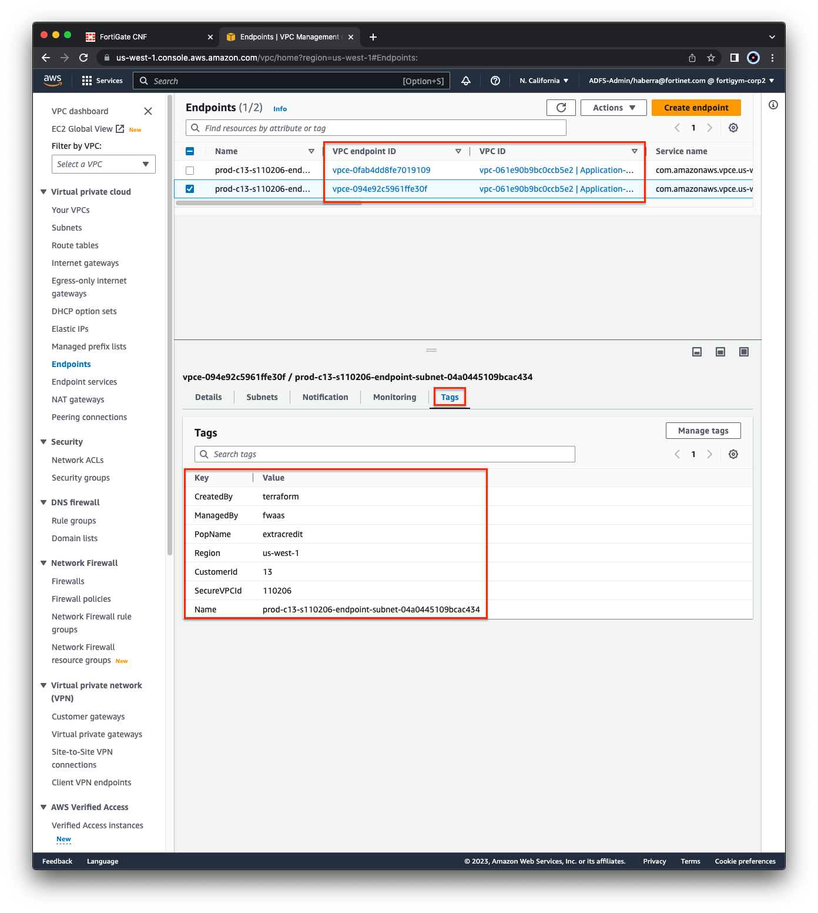
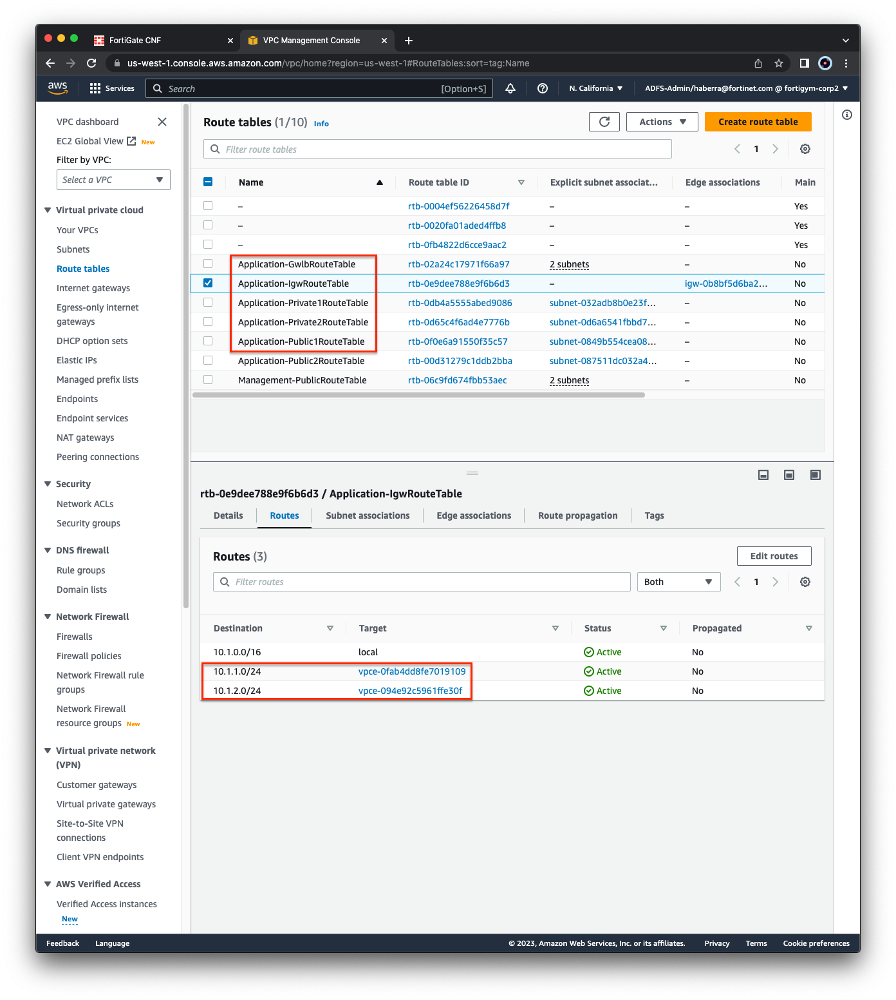
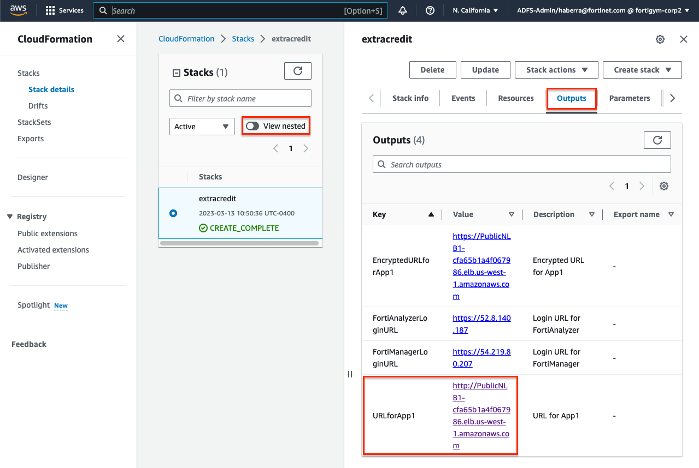
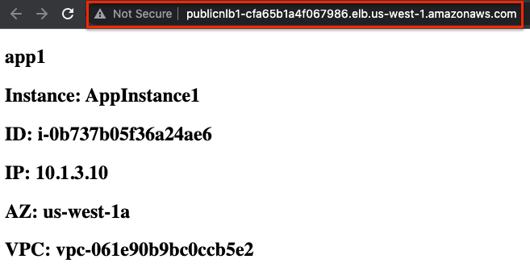

## Task 1: Deploying CNF Instances and GWLBe endpoints

{}
For this section of the workshop we will be using the **us-west-1 (N. California) region.** There is a deployment of another Application VPC where FortiGate-CNF will inspect the ingress & egress traffic flows. Also there is a Management VPC where FortiAnalyzer, FortiManager, and a Nikto Scanner are deployed.
{}

- 1.  In the AWS CloudFormation console, make sure you are in the **us-west-1 (N. California)** region, then **toggle the view nested button to off** > then select the stack name > and on the details pane select the outputs tab. You should see the output for **FortiAnalyzerLoginURL**. **Copy just the public IP** as we will need this for the next step.

- 2.  In the FortiGate CNF console, navigate to CNF instances and click **New**. Provide a name for the CNF instance, select **us-west-1 (N. California)** for the region, toggle **FortiManager mode** to on, select **FortiAnalyzer** for the log type and paste the public IP from the previous step. To save time, you can configure the GWLBe endpoints at the same time. In the Endpoints section, click the **New** button. Then you can select the account, VPC, then toggle the **Select from all subnets to off** (this filters the subnets to only show ones that are properly tagged), and the subnet to deploy the VPC endpoint to. Repeat this step for all subnets in the table below, then click the **Next** button. Once all have been created, click **OK**.

VPC | Subnet
---|---
Application-VPC | Application-GwlbeSubnet1
Application-VPC | Application-GwlbeSubnet2

- 3.  The CNF Instance should show up as **active after roughly 10 minutes** (Now is a great time for a break :) ). The endpoints will be deployed at this point.

- 4.  To validate all GWLBe endpoints have been deployed and are active (takes ~5 mins), **select and edit** the CNF instance and click **Next** to view the GWLBe endpoints on the Configure Endpoints section of the wizard. Then click **Exit** to leave the CNF configuration wizard.

- 5.  Log into your AWS Account and navigate to the **VPC Console > Endpoints**. Each of the GWLBe endpoints you deployed in the FortiGate CNF Console should be visible in your account. Notice the tag name and value pairs assigned to the endpoints.

{}
**Note:** At this point in a normal environment, you would need to create ingress and VPC routes to direct traffic to the GWLBe endpoints that were created by FortiGate CNF for inspection. However, for this workshop there is a Lambda function that is creating these routes for you to match the AWS Reference Architecture Diagram.
{}

- 6.  To validate that the relevant VPC routes have been automatically created to route traffic to the GWLBe endpoints, in the AWS VPC console, **navigate to Virtual Private Cloud > Route Tables**, select each of the route tables listed below and confirm these routes exist in the route tab of the route table details pane.

VPC Route Table | # Routes to GLWBe
---|---
Application-IgwRouteTable | 2x (one per public subnet), one per GWLBe (each AZ)
Application-Public1RouteTable | 1x (default route), GWLBe AZ1
Application-Public2RouteTable | 1x (default route), GWLBe AZ2

- 7.  To confirm that app1 in the Application VPC is reachable, in the AWS CloudFormation console, **toggle the view nested button to off** > then select the stack name > and on the details pane select the outputs tab. You should see the output for **URLforApp1**. Click on the value for that output to check that App1 is reachable now. You should see a simple webpage with some metadata about the backend web server instance that is reachable via the public Network Load Balancer (NLB).

- 8.  This concludes this section.
