## Task 2: FortiAnalyzer Integration

- 1.  In the AWS CloudFormation console, make sure you are in the **us-west-1 (N. California)** region, then **toggle the view nested button to off** > then select the stack name > and on the details pane select the outputs tab. You should see the output for **FortiAnalyzerLoginURL**. Login to the FortiAnalyzer with the username **`admin`** and the password **`FORTInet123!`**.

- 2. In the FortiAnalyzer GUI for the first login, you will be prompted to complete the setup wizard. Click **Begin**, **Next**, and **Finish**. Then on the home page, select **Device Manager**.

{}
**Note:** By default, FortiAnalyzer will be deployed with a self-signed certificate. You will see browser warnings for this and need to accept this to login successfully.
{}

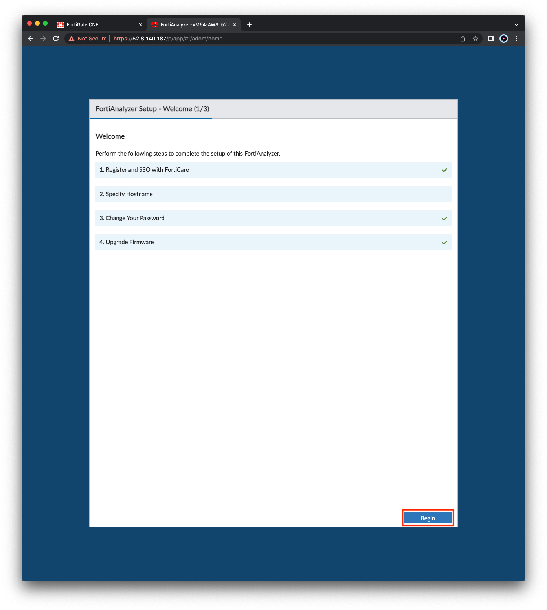

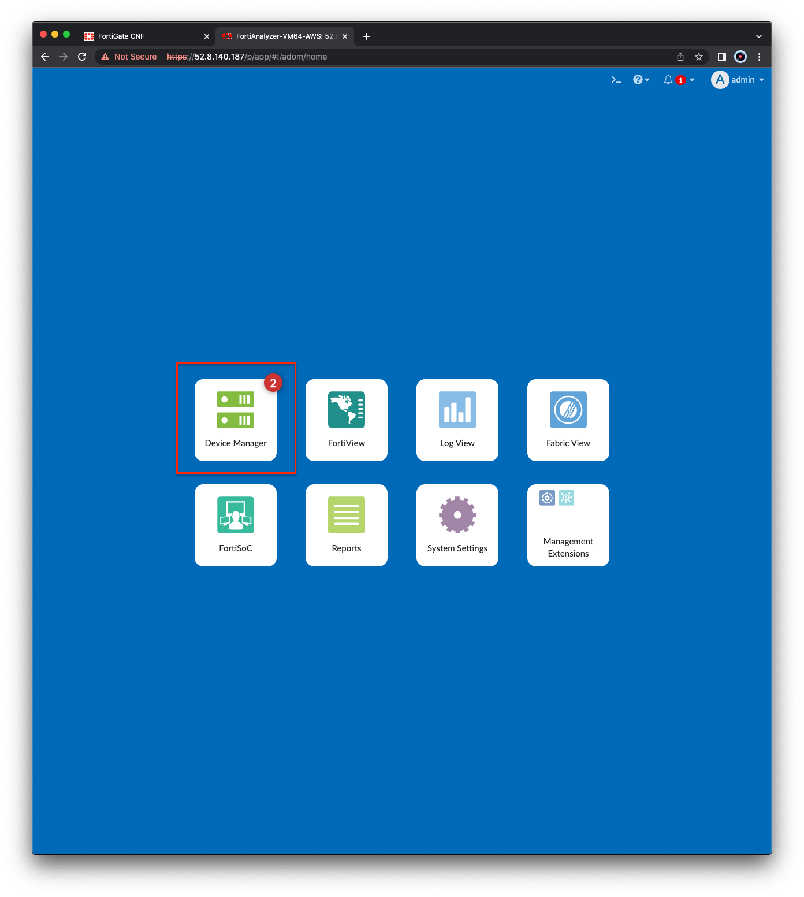

- 3. At the top right, click the **Bell icon** and select **2 Unauthorized device(s).**. Then select both devices and click **Authorize**, on the next page click **OK**. Once complete, click **Close**.

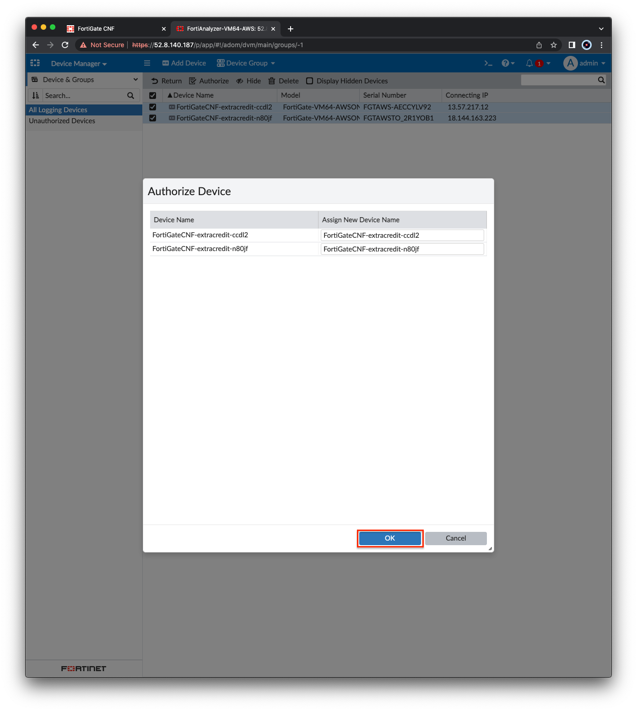

- 4.  Once logs have been received from all CNF instances, the **widgets should all show green in a few minutes**.

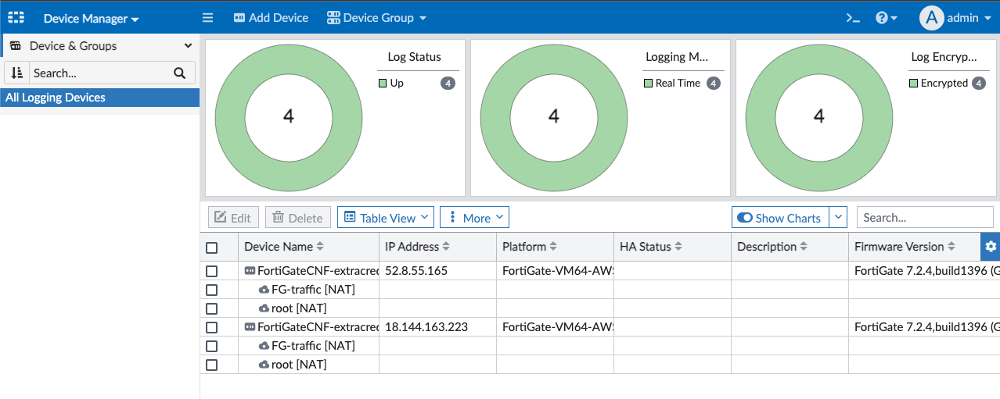

- 5.  In the top left, click **Device Manager** then click **FortiView** and look at Top Threats. **In ~15-20 minutes, logs should be generated** by the EC2 instances in the Application VPC and the Nikto Scanner instance in the Management VPC. You can **drill down on the widgets** to get more information. Click on **Eicar_TEST_File** to see the source of the malware, then click **the interface name** to get to the formatted logs. Clicking on a **log entry** will bring up the log details.

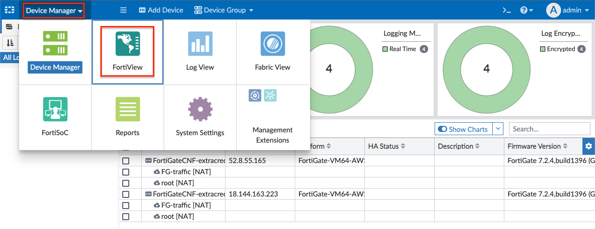

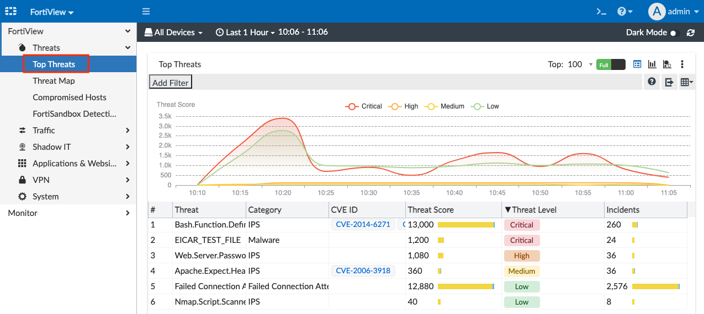

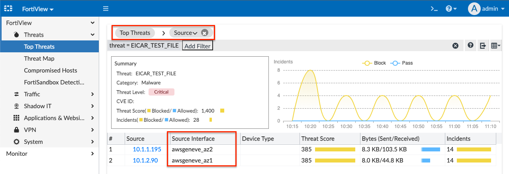

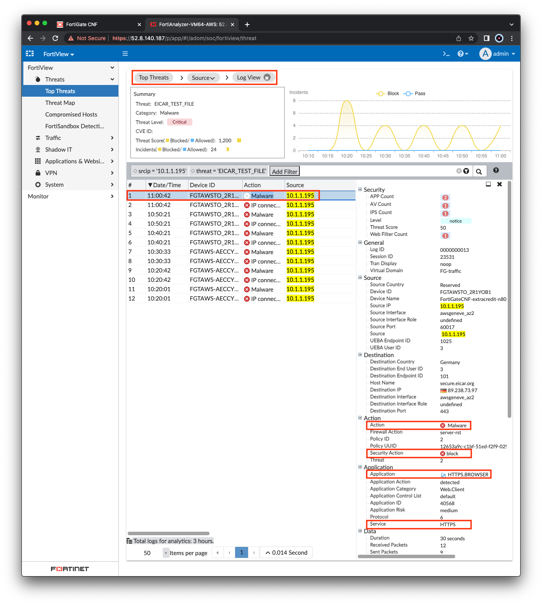

{}
**Note:** This malware was detected and blocked over a TLS encrypted connection because **SSL MitM is enabled on the outbound policy**.
{}

- 6.  Click on the following FortiView pages to see additional drill down widgets and click through the results to see more:

  * **Traffic -> Top Sources**
  * **Traffic -> Top Destinations**
  * **Traffic -> Policy Hits**
  * **Applications & Websites -> Top Applications**
  * **Applications & Websites -> Top Website Domains**
  * **Applications & Websites -> Top Categories**
  * **System -> Resource Usage**

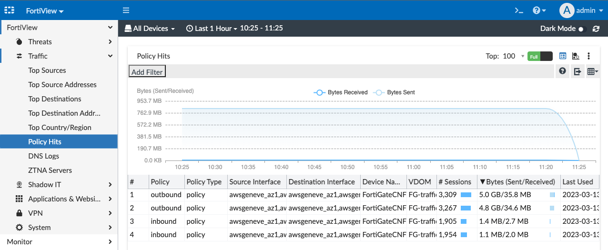

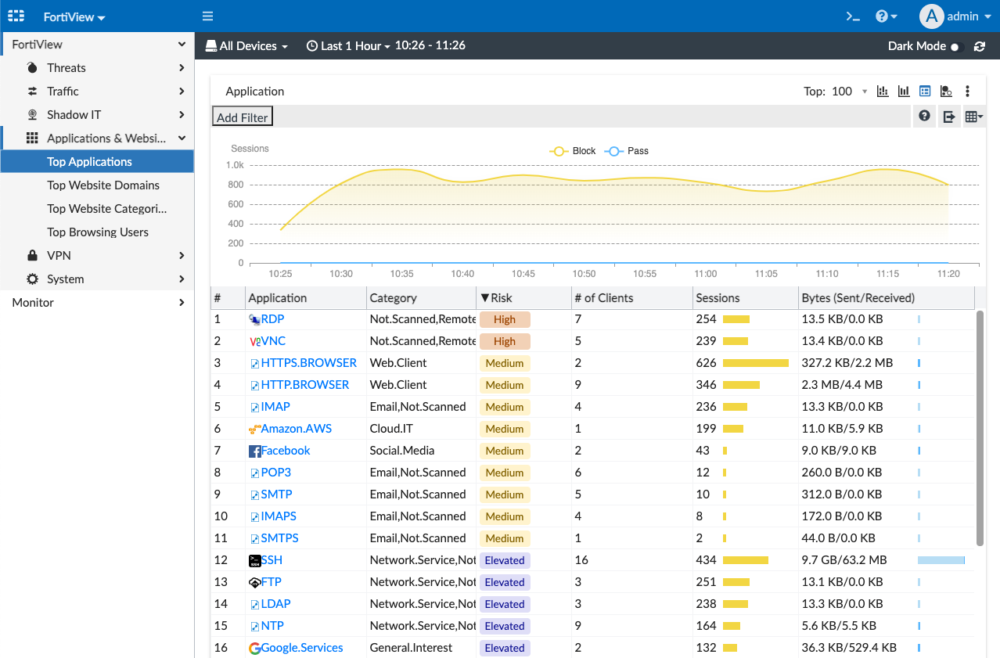

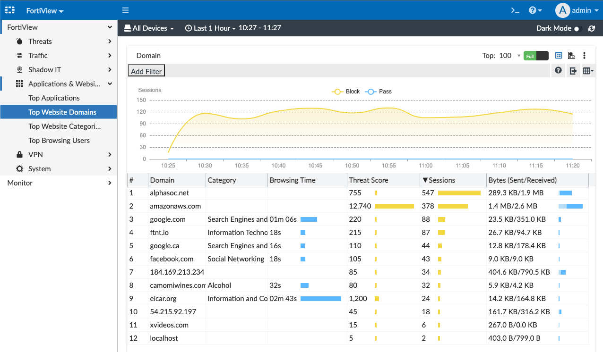

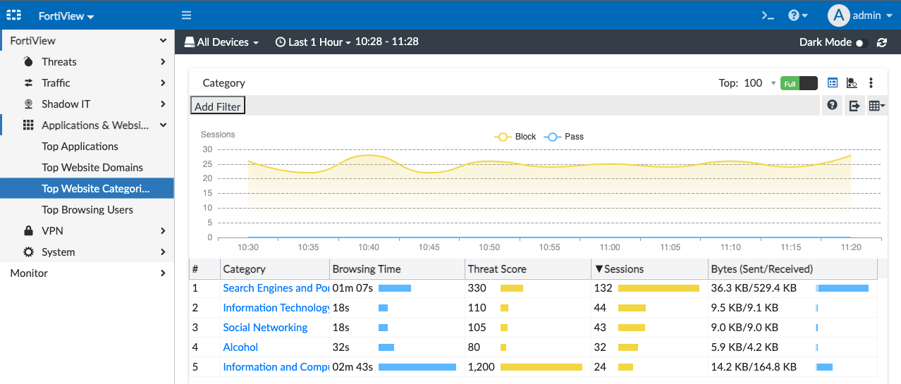

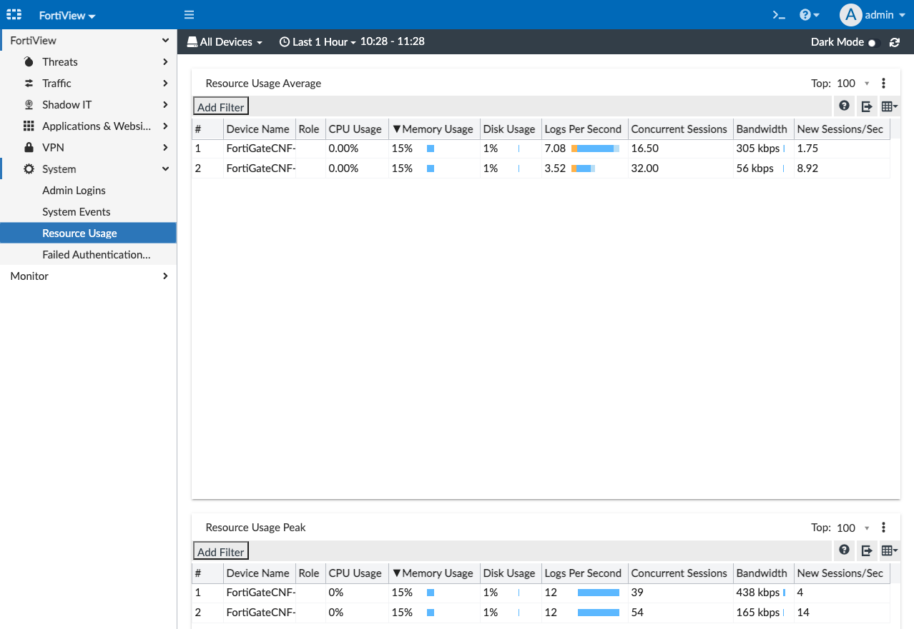

- 7.  In the top left, click **FortiView** then click **Log View** then select FortiGate -> Security -> Intrusion Prevention. **Double click any log entry** to view the log details. 

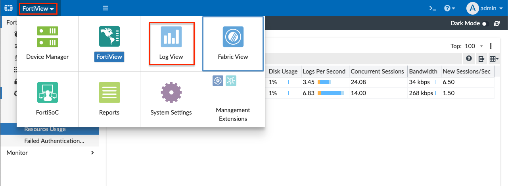

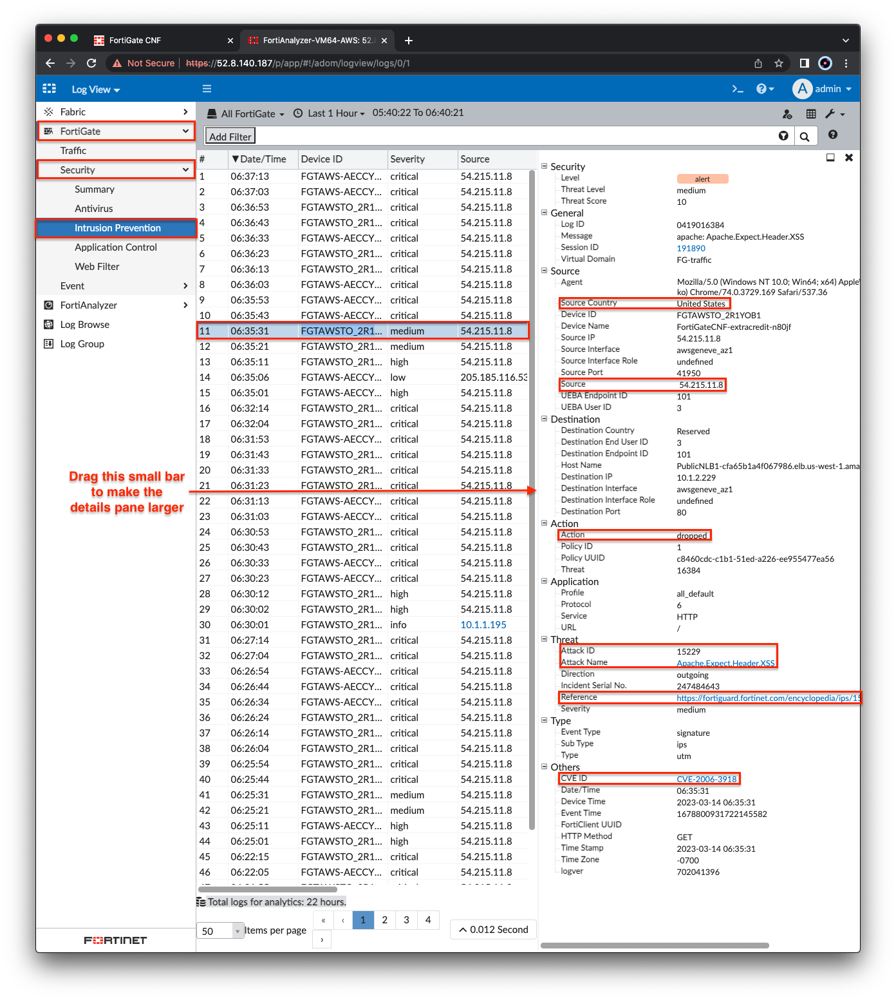

- 8.  This concludes this section.
